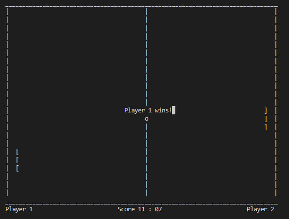
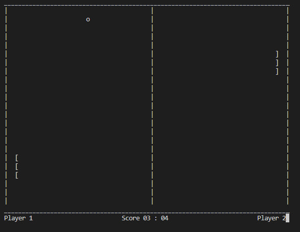
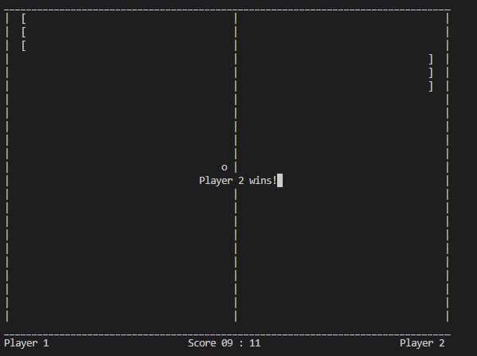

# Ping Pong game in C with ncurses
### Pet project (Summer 2024)

This repository contains a classic Ping Pong game implemented in C using the ncurses library. The game features a two-player mode where players control paddles and try to score points by hitting the ball past their opponent.

## Description

The Ping Pong game is designed to be simple yet engaging, offering a nostalgic experience reminiscent of classic arcade games. Players can control paddles using keyboard inputs and attempt to outscore their opponent. The game is played on a console and it includes basic scoring and collision detection.

## Features

- **Two-player mode**: Play with a friend using separate controls for each player.
- **Keyboard controls**: 
  - Player 1: `w` (move up), `s` (move down)
  - Player 2: `p` (move up), `l` (move down)
- **Score tracking**: The game tracks scores for both players and announces the winner.
- **Ball physics**: The ball bounces off walls and paddles, with simple collision detection.
- **End game**: The game will announce the winner when one player reaches a score of 11.
- **Field boundaries**: The game includes top, bottom, and side boundaries.

## Usage

1. **Clone the repository:**
    ```bash
    git clone https://github.com/your_username/your_repository.git
    ```

2. **Navigate to the project directory:**
    ```bash
    cd your_repository
    ```

3. **Compile the game**: Use the following command to compile the source code 
    ```bash
    gcc ping_pong.c -lncurses -o ping_pong
    ```

4. **Run the game**: Execute the compiled binary to start the game
    ```bash
    ./ping_pong
    ```

5. **Play the game**

6. **Makefile comands**:
    ```bash
    all
    clean
    format
    ```

## Screenshots

### Player 1 wins


### Game in action


### Player 2 wins


## File structure
- `ping_pong.c`: Main source code file for the game.
- `Makefile`: Build script for compiling the game.
- `.clang-format`: Code formatting configuration file.
- `materials/`: Directory containing screenshots and other assets.
- `README.md`: This file.

## Dependencies

- **ncurses**: A library for terminal handling that must be installed on your system. It can usually be installed via your package manager